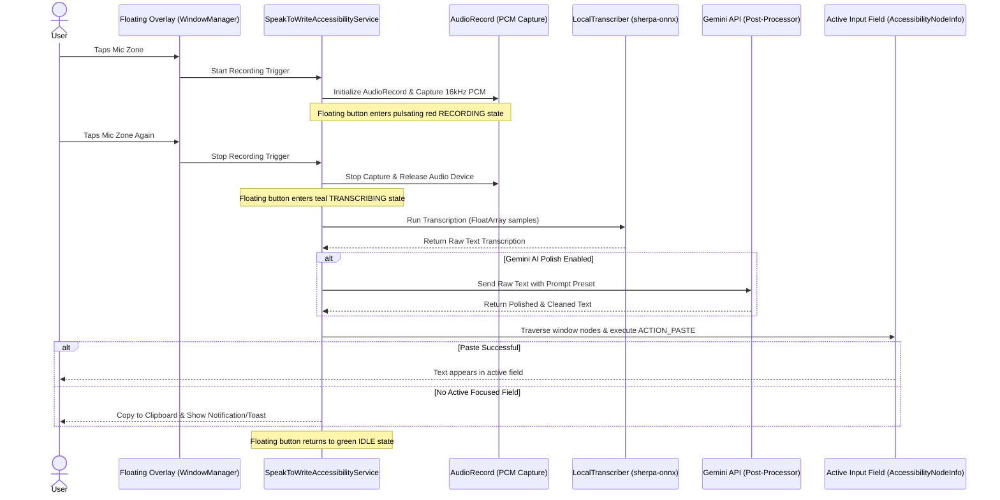

# How It Works: Speak to Write Architecture

This document provides a deep dive into the technical implementation and architectural design of **Speak to Write**, a high-performance, private, on-device voice dictation app. It details how the app integrates Android's accessibility system, offline speech recognition engines, and optional AI cleanup pipelines.

---

## 🏗️ Architecture & Interaction Flow

The diagram below illustrates the life cycle of a voice-to-text operation, from the moment a user taps the floating overlay button to text injection in the active application:



---

## 🛠️ Core Engineering Components

### 1. The Accessibility Service & System Overlay
The app extends `AccessibilityService` to gain system-level layout traversal capabilities. When enabled, it launches a persistent floating pill-shaped overlay using the `WindowManager`:

*   **Window Type:** `WindowManager.LayoutParams.TYPE_ACCESSIBILITY_OVERLAY` ensures the floating button sits on top of all other user interfaces.
*   **Zone-Aware Gestures:** The pill layout is split into two touch-sensitive zones:
    1.  **Mic Button (Left Zone):** Starts and stops audio recording.
    2.  **Arrow Button (Right Zone):** Opens a floating popup listing installed voice models, enabling real-time model switching.
*   **Snap-to-Edge Logic:** Built-in drag-and-release mechanics automatically snap the button horizontally to the nearest screen edge.

### 2. On-Device Voice Transcription Engine
Local speech-to-text is powered by the `k2fsa/sherpa-onnx` framework. The engine dynamically detects the structure of the model folder in `ctx.filesDir` to support multiple model topologies:
*   **Moonshine:** Loads preprocessor, encoder, and cached/uncached decoders.
*   **Whisper:** Loads Whisper encoder and decoder modules.
*   **Transducer:** Loads standard encoder, decoder, and joiner networks.
*   **CTC Models:** Loads CTC model layers.

All audio processing converts the 16kHz raw PCM bytes into normalized float values (`FloatArray`), which are then decoded locally by the ONNX Runtime with zero cloud connectivity.

### 3. Optional AI Post-Processor & Grammar Polish
When an API key is entered, the app integrates with Google's Gemini models (such as `gemini-1.5-flash` or `gemini-1.5-pro`). It sends the raw transcript alongside user-defined system instructions (prompts) to clean up verbal typos, add punctuation, format lists, or translate text.

### 4. Text Traversal & Automatic Injection
Upon generating the final text (either raw or AI-polished), the service traverses the active window node structure to inject it:
1.  **Traversal:** Recursively scans the tree starting from `rootInActiveWindow` looking for the node that satisfies `node.isFocused` and `node.isEditable`.
2.  **Injection:** Copies the text to the system clipboard and calls:
    ```kotlin
    targetNode.performAction(AccessibilityNodeInfo.ACTION_PASTE)
    ```
3.  **Fallback:** If no editable node has focus, it leaves the text in the system clipboard and notifies the user with a toast message.
